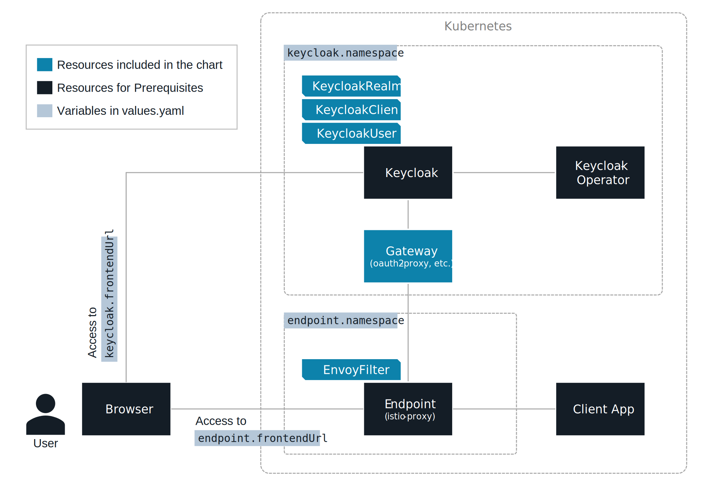

# Istio Auth Gateway

  

Istio Auth Gateway is a Helm Chart that integrates [Istio](https://github.com/istio/istio) and [Keycloak](https://github.com/keycloak/keycloak) to perform OIDC-based user authentication transparently.

This is a kind of authentication gateway using Istio that allows you to grant user authentication features to client applications that do not have them.

## Prerequisites

- [Kubernetes](https://github.com/kubernetes/kubernetes) 1.22.0 - 1.23.1
- [Helm](https://github.com/helm/helm) 3.0.0 - 3.10.0
- [Istio](https://github.com/istio/istio) 1.5.0 - 1.15.1
- [Keycloak](https://github.com/keycloak/keycloak) 1.18.0 - 19.0.2-legacy
- [Optional] [Keycloak Operator](https://github.com/keycloak/keycloak-operator) 17.0.0 - 19.0.2-legacy ... For auto-generation of Realm and Client. See [Use your own Realm and Client](#use-your-own-realm-and-client) for the details.

## Getting started

To deploy Istio Auth Gateway with the auto-generated Realm and Client, do the below.

```sh
helm install my-release --install --wait istio-auth-gateway/istio-auth-gateway \
    --set endpoint.namespace="istio-system" \
    --set keycloak.namespace="keycloak" \
    --set endpoint.frontendUrl="https://istio.example.com" \
    --set keycloak.frontendUrl="https://keycloak.example.com:8443" \
    --set endpoint.labels.app="my-sample-app"
```

The parameters mean the below(See [Values](#values) for the details).

- `endpoint.namespace` is the Namespace where an endpoint(istio-proxy) is deployed. `keycloak.namespace` is for Keycloak Operator
- `endpoint.frontendUrl` is the URL to access endpoint(istio-proxy) with a browser. `keycloak.frontendUrl` is for Keycloak
- `endpoint.labels` are the labels set for the endpoint(istio-proxy) Pod.

After deployment, access `endpoint.frontendUrl(https://istio.example.com)` in your browser and you will be redirected to the Keycloak login page.

Enter `sample` in username and password and you can access the client application.

## Architecture



Istio Auth Gateway forwards user requests to the endpoint to the gateway using an EnvoyFilter.

## Features

- End-user authentication using OpenID Connect [OAuth2 Proxy](https://github.com/oauth2-proxy/oauth2-proxy)
    - Both Istio's ingress gateway and sidecar proxy can be set as an endpoint.
- Propagate user information to client application(See [`gateway.oauth2Proxy.xAuthRequest`](#values))
- Request and authentication logging(See [`gateway.oauth2Proxy.logging.*`](#values))
- Generate Realm and Client in a Keycloak(See [`keycloak.*`](#values))

To be provided in the future.

- Set multiple users to log in
- Gateway redundancy
- Sample client application
- Istio Ingress Gateway as an endpoint
- Gateway for Open Policy Agent version

## Installation details

### Change parameters

Each parameter can also be applied using a file. For details, please refer to [values.yaml](. /values.yaml).

```sh
cat <<EOF > myValues.yaml
endpoint:
  namespace: istio-system
  frontendUrl: "https://istio.example.com"
  labels:
    app: "my-sample-app"
keycloak:
  namespace: keycloak
  frontendUrl: "https://keycloak.example.com:8443"
  realm:
    sample:
      user:
        name: "john"
        password: "passw0rd"
EOF
helm install my-release istio-auth-gateway/istio-auth-gateway -n keycloak -f ./myValues.yaml
```

### Use your own Realm and Client

If you are using an existing Realm and Client, turn off the generating feature and specify a Secret resource with `CLIENT_ID` and `CLIENT_SECRET` in `keycloak.client.secret`. In this case, Keycloak Operator is not required.

```sh
# Create secret
kubectl create secret generic myclient --namespace keycloak \
    --from-literal=CLIENT_ID=<YOUR_CLIENT_ID> \
    --from-literal=CLIENT_SECRET=<YOUR_CLIENT_SECRET>

# Deploy istio-auth-gateway
cat <<EOF > myValues.yaml
endpoint:
  namespace: istio-system
  frontendUrl: "https://istio.example.com"
  labels:
    app: "my-sample-app"
keycloak:
  namespace: keycloak
  frontendUrl: "https://keycloak.example.com:8443"
  realm:
    sample:
      create: false
  client:
    secret: "myclient"
    sample:
      create: false
EOF
helm install my-release istio-auth-gateway/istio-auth-gateway -n keycloak -f ./myValues.yaml
```

## Uninstalling

You can uninstall components of istio-auth-gateway installed above.

```sh
helm ls
helm delete my-release
```

If you have deployed a Secret of `CLIENT_ID` and `CLIENT_SECRET`, delete it as well.

```sh
kubectl delete secret myclient --namespace keycloak
```

## Values

| Key | Type | Default | Description |
|-----|------|---------|-------------|
| global.clusterDomain | string | `"cluster.local"` | Domain name of the Kubernetes cluster |
| endpoint.namespace | string | `"default"` | Namespace where the target istio-proxy is located |
| endpoint.labels | object | `{"app":"istio-authgateway"}` | Labels of istio-proxy |
| endpoint.frontendUrl | string | `"https://app.example.com"` | Externally published istio-proxy URL; used for OIDC redirects |
| endpoint.timeout | string | `"5s"` | Waiting time for authentication process at gateway |
| keycloak.namespace | string | `"keycloak"` | Namespace where Keycloak CR is located |
| keycloak.frontendUrl | string | `"https://keycloak.example.com"` | Externally published Keycloak URL; used for OIDC redirects |
| keycloak.realm.name | string | `"gateway"` | Name of a realm to which a KeycloakClient is tied. |
| keycloak.realm.sample.create | bool | `true` | Generating a KeycloakRealm CR as a sample |
| keycloak.realm.sample.keycloakLabels | object | `{"app":"keycloak"}` | Labels of the Keycloak CR that will create the Realm |
| keycloak.realm.sample.user.create | bool | `true` | Generating a KeycloakUser CR as a sample |
| keycloak.realm.sample.user.name | string | `"sample"` | Sample user name for login |
| keycloak.realm.sample.user.password | string | `"sample"` | Sample user password for login |
| keycloak.client.secret | string | `""` | Secret resource includes CLIENT_ID and CLIENT_SECRET. This is usually created by a Keycloak Operator, but you can also use your own secret. This Secret must be in the same Namespace as the Istio Auth Gateway. If `keycloak.client.sample.create` is true, the field is ignored |
| keycloak.client.sample.create | bool | `true` | Specifies whether a sample KeycloakClient  is created |
| keycloak.client.sample.name | string | `"gateway"` | Name of a KeycloakRealm CR to which a KeycloakClient is tied. |
| keycloak.client.sample.realmLabels | object | `{"app":"auth-gateway"}` | Labels of the KeycloakRealm CR that will create the Client. If you generate a sample realm, this field is ignored. |
| gateway.type | string | `"oauth2-proxy"` | Types of tools to be used as an authorization gateway. Currently only oauth2-proxy |
| gateway.oauth2Proxy.cookie.name | string | `"auth-gateway"` | Cookie name of login session. you should add a [cookie prefix](https://developer.mozilla.org/en-US/docs/Web/HTTP/Headers/Set-Cookie#cookie_prefixes) (__Host- or __Secure-) if gateway.oauth2Proxy.cookie.secure is true |
| gateway.oauth2Proxy.cookie.sameSite | string | `"strict"` | SameSite attribute "strict" or "lax" or none" |
| gateway.oauth2Proxy.cookie.refresh | string | `"1m"` | Refresh duration of the cookie. 0 to disable |
| gateway.oauth2Proxy.cookie.expire | string | `"2m"` | Expire duration of the cookie. It cannot be disabled |
| gateway.oauth2Proxy.cookie.secure | bool | `false` | Set secure cookie flag |
| gateway.oauth2Proxy.emailDomains | string | `"*"` | Email domains of permitted users. Multiple domains can be specified separated by commas, such as "foo.com, bar.net". "*" means any domain. |
| gateway.oauth2Proxy.sslInsecureSkipVerify | bool | `false` | Skip verification of https certificates. If using a self-signed certificate, set true |
| gateway.oauth2Proxy.xAuthRequest | bool | `true` | Propagate user info(email, username) to the client application |
| gateway.oauth2Proxy.logging.auth | bool | `true` | Specifies whether to output the log when a user authenticates |
| gateway.oauth2Proxy.logging.request | bool | `true` | Specifies whether to output request logs |
| gateway.oauth2Proxy.logging.healthCheckLog | bool | `false` | Specifies whether to output request logs of health check |
| gateway.oauth2Proxy.extraEnvVars | list | `[]` | Extra environment variables to add to oauth2-proxy. Please see [values.yaml](./values.yaml) and [Oauth2 Proxy](https://oauth2-proxy.github.io/oauth2-proxy/docs/configuration/overview/) for details. |
| gateway.oauth2Proxy.image.repository | string | `"quay.io/oauth2-proxy/oauth2-proxy"` | Container image repository of OAuth2 Proxy |
| gateway.oauth2Proxy.image.tag | string | `"v7.3.0"` | Container image tag of OAuth2 Proxy (immutable tags are recommended) |
| gateway.oauth2Proxy.image.pullPolicy | string | `"IfNotPresent"` | Container image pull policy of OAuth2 Proxy |
| gateway.oauth2Proxy.imagePullSecrets | list | `[]` | Container image pull secrets of OAuth2 Proxy |
| gateway.oauth2Proxy.service.type | string | `"ClusterIP"` | Service type of OAuth2 Proxy "ClusterIP" or "NodePort" or "LoadBalancer" |
| gateway.oauth2Proxy.service.port | int | `4180` | Service and Target port of OAuth2 Proxy |
| gateway.oauth2Proxy.service.nodePort | int | `34180` | Node port of OAuth2 Proxy. This only applies when `service.type` is "NodePort" |
| gateway.resources | object | `{}` | Resource requests and limits for the gateway deployment. Please see [values.yaml](./values.yaml) for details. |
| gateway.podAnnotations | object | `{}` | Annotations for the gateway deployment. |
| gateway.podSecurityContext | object | `{}` | SecurityContext for the all containers in gateway pod. Please see [values.yaml](./values.yaml) for details. |
| gateway.securityContext | object | `{}` | SecurityContext for the gateway container. Please see [values.yaml](./values.yaml) for details. |
| gateway.nodeSelector | object | `{}` | Node labels for the gateway deployment |
| gateway.tolerations | list | `[]` | Tolerations for the gateway deployment |
| gateway.affinity | object | `{}` | Affinities for the gateway deployment |
| serviceAccount.create | bool | `true` | Specifies whether a service account should be created |
| serviceAccount.annotations | object | `{}` | Annotations to add to the service account |
| serviceAccount.name | string | `""` | The name of the service account to use. If not set and create is true, a name is generated using the fullname template |

## Contributing

Please feel free to submit Issues and Pull Requests.

## License

Copyright 2022 Istio Auth Gateway Authors.

Licensed under the Apache License, Version 2.0 (the "License"); you may not use this file except in compliance with the License. You may obtain a copy of the License at

```sh
http://www.apache.org/licenses/LICENSE-2.0
```

Unless required by applicable law or agreed to in writing, software distributed under the License is distributed on an "AS IS" BASIS, WITHOUT WARRANTIES OR CONDITIONS OF ANY KIND, either express or implied. See the License for the specific language governing permissions and limitations under the License.
